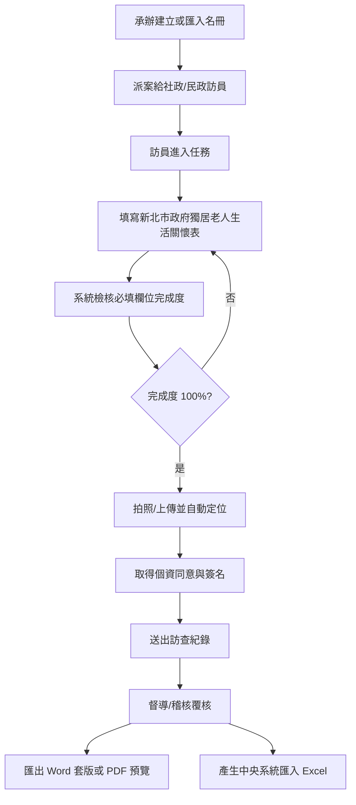

# 新北市政府獨居老人生活關懷表流程說明

## 測試資料

本系統已建立一筆模擬測試資料：

- 個案：吳秀枝
- 案號：NTPC-115-TEST-001
- 區里：新北市板橋區新民里
- 排程：schedule_ntpc_demo
- 測試頁：`/visitor/visits/schedule_ntpc_demo`

進入測試頁後，系統會自動帶入一份完整的新北關懷表模擬答案，可直接驗證完成度、送出與匯出入口。

## 操作流程

## 畫面說明

### 1. 進入訪員訪視頁

路徑：

`/visitor/visits/schedule_ntpc_demo`

頁面上方會看到：

- 長者姓名
- 案號
- 行政區與里別
- 第幾次訪視
- 離線草稿保存狀態

### 2. 填寫新北關懷表

關懷表分成五個區塊：

1. 一、獨居老人基本資料
2. 二、居住與家庭支持
3. 三、身體狀況
4. 四、生活困難、情緒與活動
5. 五、訪查員觀察題

每個區塊使用百葉窗展開，右側會顯示該區必填欄位完成數。

### 3. 完成度檢核

系統會即時計算：

- 整份表單完成度百分比
- 必填欄位完成數
- 尚缺必填欄位

必填欄位未完成時，不能送出訪查紀錄，也不能產生 Word / PDF。

### 4. Word / PDF 匯出

表單完成度達 100% 後，可使用：

- `匯出 Word 套版`
- `匯出 PDF 預覽`

目前輸出的是套版資料與 PDF 預覽內容。下一階段會把欄位寫回 `新北市政府獨居老人生活關懷表(空白).docx` 的勾選框與文字欄位，並產出正式 PDF。

### 5. 後台 Excel 匯出

承辦或督導可到：

`/manager/exports`

選擇：

- `社會局中央系統匯入 Excel`

目前已建立欄位模板，正式欄位順序需依社會局提供的中央系統格式鎖定。

## 驗證清單

- [ ] 開啟 `/visitor/visits/schedule_ntpc_demo`
- [ ] 確認顯示 `新北市政府獨居老人生活關懷表`
- [ ] 確認完成度為 100%
- [ ] 展開各段表單，確認欄位已有模擬答案
- [ ] 點選 `匯出 Word 套版`
- [ ] 點選 `匯出 PDF 預覽`
- [ ] 送出訪查紀錄
- [ ] 到 `/manager/exports` 確認有 `社會局中央系統匯入 Excel` 模板

## 目前限制

- Word 目前是套版資料輸出，尚未直接改寫 docx 勾選框。
- PDF 目前是預覽資料輸出，尚未接正式 PDF renderer。
- 中央系統 Excel 欄位順序需依社會局提供規格再固定。
